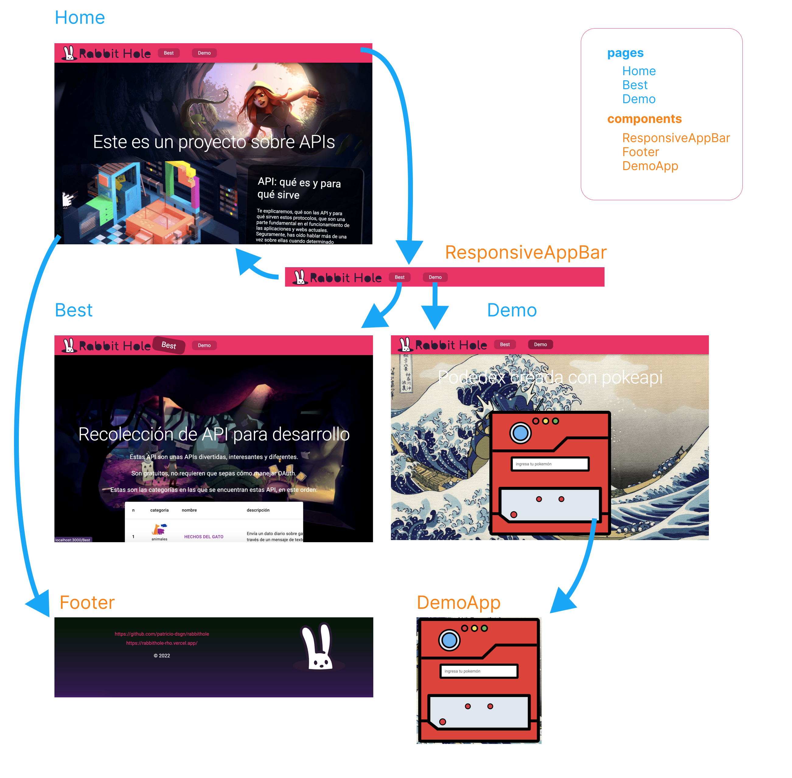

# Examen certificación React JS

## 1. Conexión y consumo de apis

- **Fetch**: en la página [Best](https://rabbithole-rho.vercel.app/best)
se ha implementado una tabla de información con desde un archivo json.

- **Axios**: en la página [Demo](https://rabbithole-rho.vercel.app/demo)
se ha implementado una app para consultar información de pokemones usando [pokeapi](https://pokeapi.co/).

## 2. Creación de rutas

- **Navegación**: mediante [React Router Dom](https://v5.reactrouter.com/web/guides/quick-start)
se ha implementado el siguiente esquema de navegación

[sitio](https://rabbithole-rho.vercel.app/best)

        Home
        |
        |--Best
        |
        |--Demo

        Error 404

<kbd style="width:80%;">

</kbd>

- **Lazy loading**: para optimizar las cargas se ha implementado en imágenes el componente de página **Home**

## 3. Readme con

- la explicación del patrón de arquitectura utilizado

- patrones de diseños utilizados

- descripción del proyecto

## 4. Arquitectura limpia

Aplicar basado en **patrones de arquitecturas** vistos en el curso y buenas prácticas de **Code Splitting**

- clean arquitecture

- webpack

- babel

- lazy loading

- HOC de ErrorBoundary (límites de error) recovery hacia la página principal

## 5. Patrones de diseños

- Aplicar algunos aplicados en el curso

## 6. Página not found 404

- Implementación

## 7. Aplicar el uso de hooks y ciclos de vida basado en componentes funcionales

## 8. Creación de algunos custom hook

## 9. Utilización de Prop-Types en por lo menos 3 componentes

## 11. Despliegue en producción en Vercel

## 12. La UI la pueden implementar como mas les acomode y crear el responsive design

## 13. Investigar y crear algunos componentes de estilos (Styled-Components)
