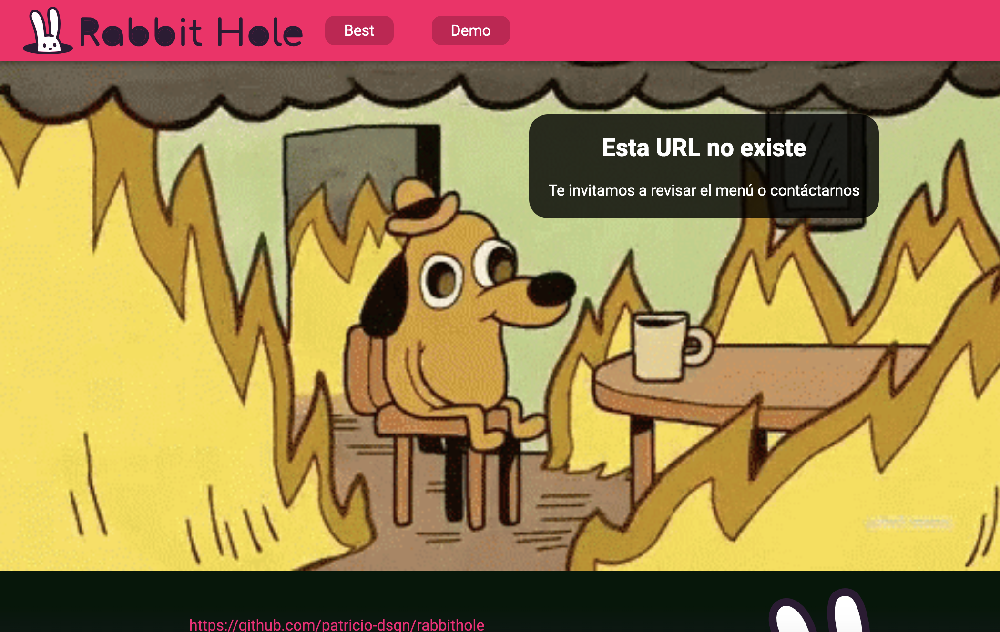

# Examen certificación React JS

## 0. Uso de Context API

- Este proyecto usa Context API para cambiar el tema de la barra de navegación `component/responsiveappbar/responsiveappbar.component.jsx` mediante `ThemeProvider`

## 1. Conexión y consumo de apis

- **Fetch**: en la página [Best](https://rabbithole-rho.vercel.app/best)
se ha implementado una tabla de información con desde un archivo json.

- **Axios**: en la página [Demo](https://rabbithole-rho.vercel.app/demo)
se ha implementado una app para consultar información de pokemones usando [pokeapi](https://pokeapi.co/).

## 2. Creación de rutas

- **Navegación**: mediante [React Router Dom](https://v5.reactrouter.com/web/guides/quick-start)
se ha implementado el siguiente esquema de navegación.

[sitio](https://rabbithole-rho.vercel.app/best)

        Home
        |
        |--Best
        |
        |--Demo

        Error 404

<kbd style="width:80%;">

</kbd>

- **Lazy loading**: para optimizar las cargas se ha implementado en imágenes el componente de página **Home**

## 3. Readme

- **La explicación del patrón de arquitectura utilizado y patrón de diseños utilizados**: Se han aplicado el patrón explicado en el proyecto 1, separando componentes en: componentes de páginas en directorio `pages` y componentes en directorio `components`.

- el directorio de archivos estáticos es `assets`.

- Cada componente posee su carpeta y adentro un archivo con esta nomenclatura

        pages
            nombre
                nombre.component.jsx
                nombre.styles.scss

        components
            nombre
                nombre.component.jsx
                nombre.styles.scss

- **descripción del proyecto**: se encuentra en este documento.

## 4. Arquitectura limpia

Aplicar basado en **patrones de arquitecturas** vistos en el curso y buenas prácticas de **Code Splitting**

- clean arquitecture: se han aplicado el patrón explicado en el proyecto 1 

- lazy loading: Se ha aplicado en la imágenes en el componente `pages/home/home.page.jsx` usando Suspense.

- HOC de ErrorBoundary (límites de error) con recovery hacia la página principal: se ha implentado en `pages/demo/demo.page.jsx`, usanado el componente `<Error/>` en la inclusión de la app tipo pokedex, `components/demoapp/demoapp.component.jsx` (hay un error simulado que está comentado en las líneas 8 y 9).

## 5. Patrones de diseños

- Componente React Render Props
- HOC patrón de diseño

## 6. Página not found 404

<kbd style="width:80%;">

</kbd>

## 7. Aplicar el uso de hooks y ciclos de vida basado en componentes funcionales

- aplicados en `components/demoapp/demoapp.components.jsx`

## 8. Custom Hook

- Se ha creado el hook personalizado "useTheme"(linea 24):

`context/ThemeProvider.js`

## 9. Prop-Types

- Se ha utilizado Prop-Types.

## 11. Despliegue en producción en Vercel

- [rabbithole-rho.vercel.app](https://rabbithole-rho.vercel.app/)

## 12. La UI la pueden implementar como mas les acomode y crear el responsive design

- Se ha implementado [Material UI](https://mui.com/).

- Se ha incorporado [Sass](https://sass-lang.com/).

- Se ah desarrollado **responsive design** con _mediaquery_ y con **props propias de Material UI**.

## 13. Styled-Components

- Se ha utilizado

## INSTRUCTIONS

This project was bootstrapped with [Create React App](https://github.com/facebook/create-react-app).

### Available Scripts

In the project directory, you can run:

#### `npm start`

Runs the app in the development mode.\
Open [http://localhost:3000](http://localhost:3000) to view it in your browser.

The page will reload when you make changes.\
You may also see any lint errors in the console.

#### `npm test`

Launches the test runner in the interactive watch mode.\
See the section about [running tests](https://facebook.github.io/create-react-app/docs/running-tests) for more information.

#### `npm run build`

Builds the app for production to the `build` folder.\
It correctly bundles React in production mode and optimizes the build for the best performance.

The build is minified and the filenames include the hashes.\
Your app is ready to be deployed!

See the section about [deployment](https://facebook.github.io/create-react-app/docs/deployment) for more information.

#### `npm run eject`

**Note: this is a one-way operation. Once you `eject`, you can't go back!**

If you aren't satisfied with the build tool and configuration choices, you can `eject` at any time. This command will remove the single build dependency from your project.

Instead, it will copy all the configuration files and the transitive dependencies (webpack, Babel, ESLint, etc) right into your project so you have full control over them. All of the commands except `eject` will still work, but they will point to the copied scripts so you can tweak them. At this point you're on your own.

You don't have to ever use `eject`. The curated feature set is suitable for small and middle deployments, and you shouldn't feel obligated to use this feature. However we understand that this tool wouldn't be useful if you couldn't customize it when you are ready for it.

### Learn More

You can learn more in the [Create React App documentation](https://facebook.github.io/create-react-app/docs/getting-started).

To learn React, check out the [React documentation](https://reactjs.org/).

#### Code Splitting

This section has moved here: [https://facebook.github.io/create-react-app/docs/code-splitting](https://facebook.github.io/create-react-app/docs/code-splitting)

#### Analyzing the Bundle Size

This section has moved here: [https://facebook.github.io/create-react-app/docs/analyzing-the-bundle-size](https://facebook.github.io/create-react-app/docs/analyzing-the-bundle-size)

#### Making a Progressive Web App

This section has moved here: [https://facebook.github.io/create-react-app/docs/making-a-progressive-web-app](https://facebook.github.io/create-react-app/docs/making-a-progressive-web-app)

#### Advanced Configuration

This section has moved here: [https://facebook.github.io/create-react-app/docs/advanced-configuration](https://facebook.github.io/create-react-app/docs/advanced-configuration)

#### Deployment

This section has moved here: [https://facebook.github.io/create-react-app/docs/deployment](https://facebook.github.io/create-react-app/docs/deployment)

#### `npm run build` fails to minify

This section has moved here: [https://facebook.github.io/create-react-app/docs/troubleshooting#npm-run-build-fails-to-minify](https://facebook.github.io/create-react-app/docs/troubleshooting#npm-run-build-fails-to-minify)
